# 🩺 Disease Prediction System

A Machine Learning based web application that predicts possible diseases based on user symptoms and provides analytics dashboard.

---

## 🌐 Live Demo

Try the application here:

https://disease-prediction-system-852t.onrender.com

---
## 🚀 Features

- Symptom based disease prediction
- Machine Learning model integration
- Disease dataset analysis
- Emergency urgency detection
- User prediction statistics
- Admin-Dashboard statistics
- Dashboard charts using Chart.js
- Clean and responsive UI
- Login , Signup & Update password

---

## 🎥 Demo

This application predicts diseases based on user symptoms using a trained machine learning model integrated with Django.

Users can:

- Select symptoms
- Get predicted disease
- View prediction statistics
- User can see disease Outbreak Alerts & User Recent Predictions charts
- Admin can see Recent Outbreak Alerts ,Disease Trends (Last 7 Days), Distribution of Diseases & Growth of Cases.
- Login & Signup
- Profile and About

  ***

## 📸 Application Screenshots

### Home Page

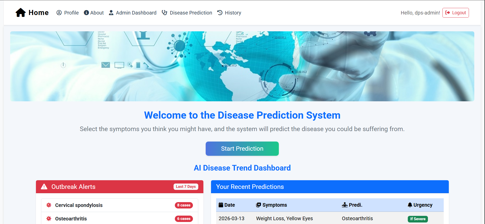
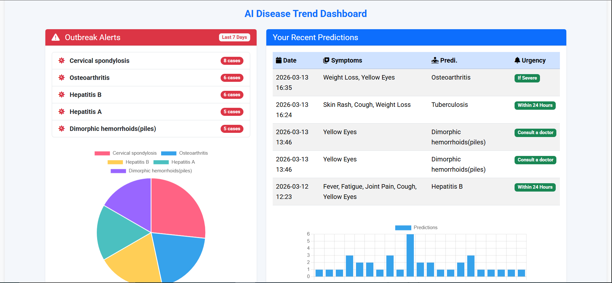

### About Page

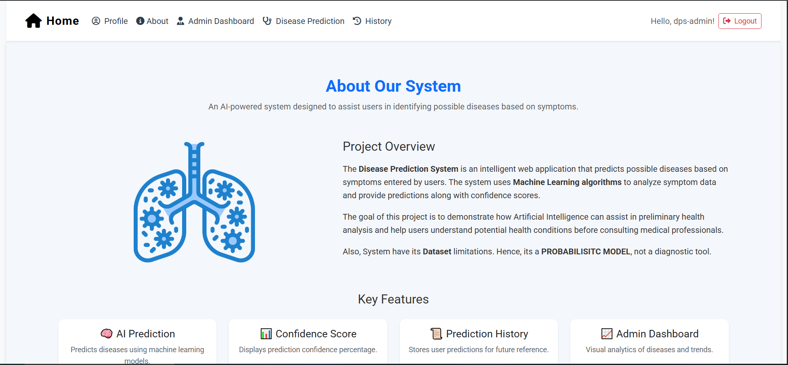

### Signup

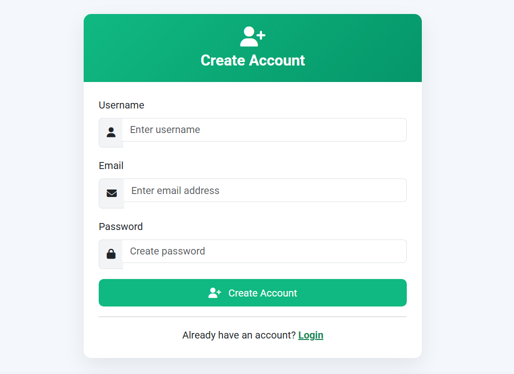

### Login

### Disease Prediction

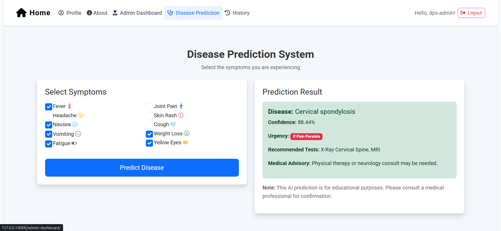

### User Profile

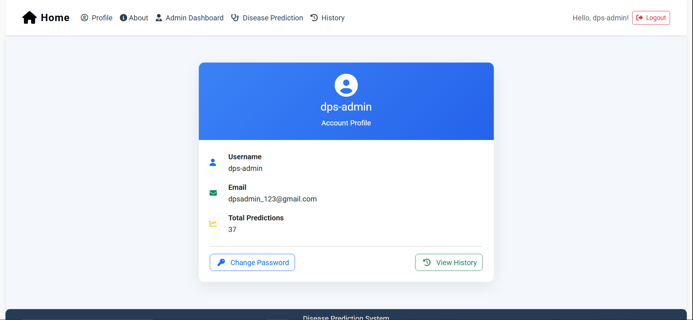
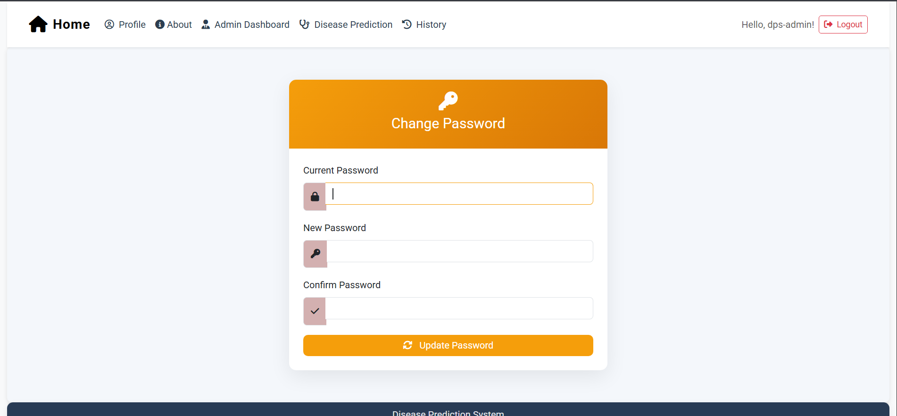

### Prediction History

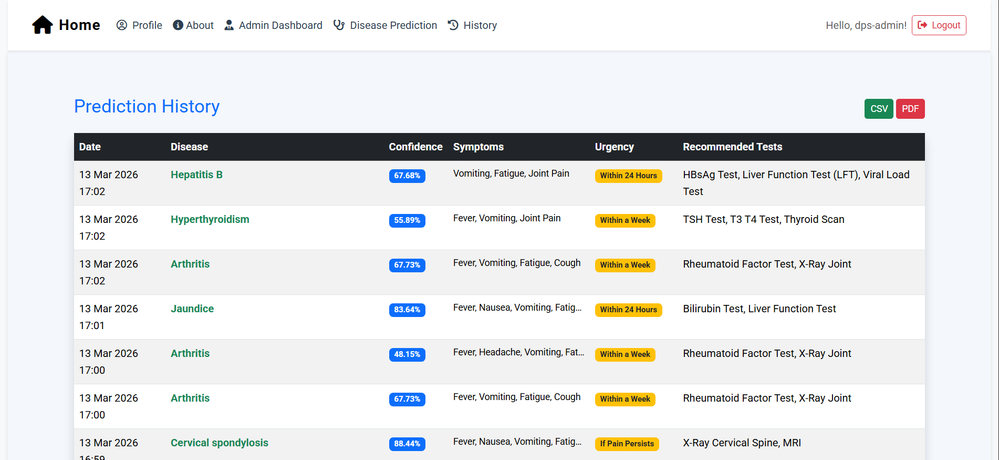

### Admin Dashboard

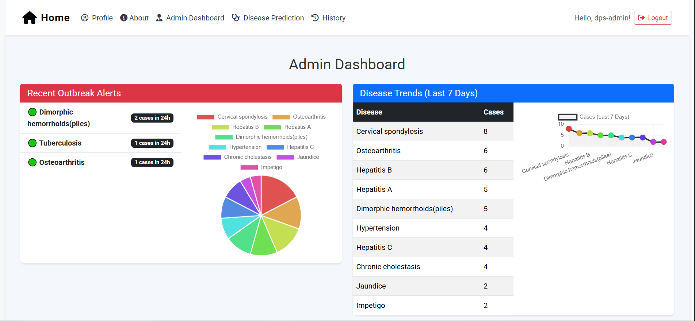
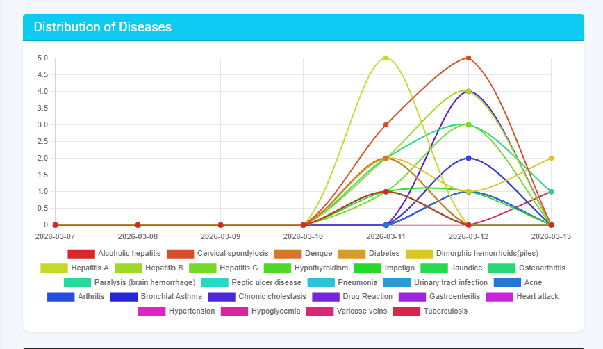
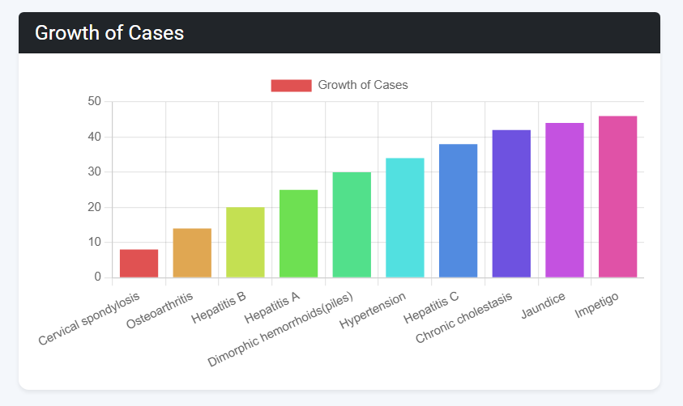

---

## 🧠 Machine Learning

The system uses a trained ML model to analyze symptoms and predict the most likely disease.

Files used:

- best_model.pkl → trained prediction model
- label_encoder.pkl → disease label encoder
- improved_disease_dataset.csv → training dataset

---

## 🛠 Tech Stack

- Python
- Django
- Scikit-learn
- HTML
- CSS
- JS
- Bootstrap
- Chart.js

---

## 📂 Project Structure

MYPROJECT
│
├── screenshots
│
├── myapp
│ ├── **init**.py
│ ├── apps.py
│ ├── tests.py
│ ├── migrations
│ ├── templates
│ ├── admin.py
│ ├── alerts.py
│ ├── views.py
│ ├── urls.py
│ ├── models.py
│ ├── forms.py
│ ├── symptom_extractor.py
│ ├── cluster_analysis.py
│ ├── urgency_map.py
│ ├── best_model.pkl
│ └── label_encoder.pkl
│
├── myproject
│ ├── settings.py
│ ├── urls.py
│ ├── asgi.py
│ └── wsgi.py
│
├── static
│ ├── css
│ ├── img
│ └── js
│
├── improved_disease_dataset.csv
├── requirements.txt
├── manage.py
├── test_symptoms.py
├── README.md
└── .gitignore

---

## ⚙️ Installation

Clone the repository -

- git clone https://github.com/Anjali-990/Disease_Prediction_System.git

Move into the project -

- cd disease-prediction-system

Install dependencies -

- pip install -r requirements.txt

Run migrations -

- python manage.py migrate

Start server -

- python manage.py runserver

Open browser-

- http://127.0.0.1:8000

---

## 📊 Future Improvements

- User login system
- Prediction history
- Disease severity analysis
- Doctor recommendation system
- Deployment on cloud

---

## 👩‍💻 Author

- Developed by **Anjali**
- **Major Project**
